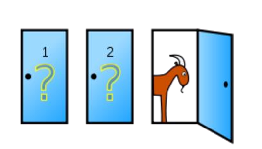

# Monty Hall Problem Simulator - Backend

## Application Heading
Monty Hall Problem Simulator

## Application Description
The Monty Hall Problem Simulator backend is built using .NET 8. It provides the logic and APIs to run the simulations and return the results to the frontend. This application simulates the Monty Hall problem, a famous probability puzzle based on a game show scenario. In the game, a player chooses one of three closed doors, behind one of which is a car, while the other two hide goats. After the initial choice, the presenter reveals one of the remaining doors, showing a goat. The player then has the option to switch their choice to the other unopened door. The simulator allows users to specify the number of simulations and whether to switch doors, then displays the results including total games, wins, losses, and win percentage. This helps determine if changing the door increases the player's chances of winning.

## App Scenario


## How to Run the Backend App
To run the backend application, follow these steps:

1. **Clone the Repository:**
   ```bash
   git clone <repository-url>
   cd monty_hall_backend_.net

2. **Install Dependencies:**
   ```bash
   dotnet restore

3. **Run the application:**
   ```bash
   dotnet run